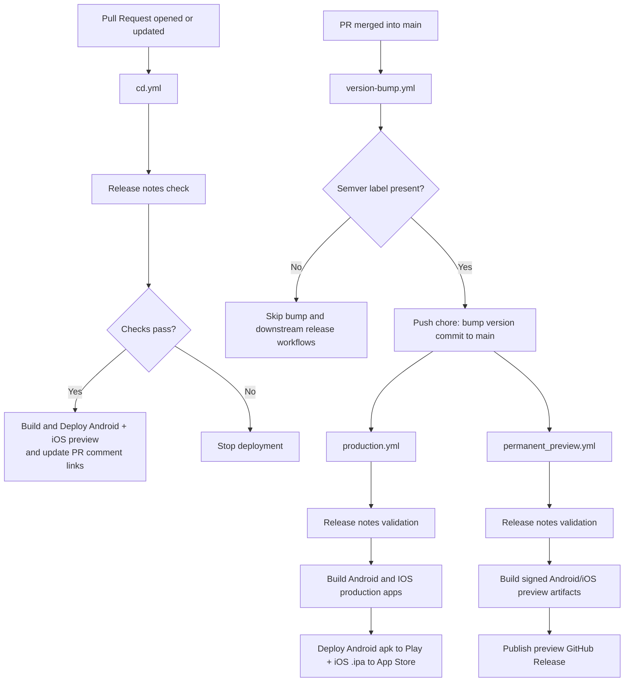

# Continuous Delivery

GitHub Actions + Fastlane handle preview, production, and permanent-preview deployments for Android and iOS.

- **Triggers:** PR events (preview deploys), merged PRs to `main` (auto version bump), and version-bump commit pushes to `main` (production + permanent preview).
- **Issue routing:** file CD issues in GitHub with the `Devops` label so deployment owners are notified.

## Workflow Flow Diagram

## Preview Deployments ([`cd.yml`](../.github/workflows/cd.yml))

**What runs**

- Release notes validation: requires [`docs/release_notes/release_notes.md`](./release_notes/release_notes.md), non-empty, <= 500 characters, and not equal to placeholder-only content. The validated text is emitted as workflow output and injected into:
  - [`android/fastlane/metadata/android/en-US/changelogs/default.txt`](../android/fastlane/metadata/android/en-US/changelogs/default.txt)
  - ENV variable for iOS Fastlane upload (“What to Test”)
- Environment injection: Doppler secrets write environment-specific `.env` values for preview builds.
- Android preview build (Firebase App Distribution):
  - Takes `versionNameOverride` from [`package.json`](../package.json)
  - Calculates `versionCodeOverride = major*10000 + minor*100 + patch`
  - Uses `ANDROID_PREVIEW_FLAVOR` (default `preview`) so the `.preview` package installs alongside production.
  - Uploads APK/AAB to Firebase with validated release notes and comments on the PR with the download link.
- iOS preview build (TestFlight):
  - Takes marketing `version` from [`package.json`](../package.json)
  - `build_number` = `<PR_NUMBER><YYMMDDHHMM>` for uniqueness per PR (example: PR `123` at `2502141030` -> `1232502141030`)
  - Uses Fastlane with preview signing, attaches release notes, and comments on the PR with build link.
- PR comment summarizes Firebase + TestFlight artifacts with links.

## Automatic Version Bump ([`version-bump.yml`](../.github/workflows/version-bump.yml))

**Trigger:** merged pull requests to `main` (`pull_request_target` on `closed` + `if: merged == true`).

**Why bot is required**

- `main` is protected for security and regular code changes are expected to land via pull requests only.
- Version bump is a post-merge automation commit, so it needs a controlled bypass identity.
- This project uses `Better Software-version-bump-bot` as that controlled identity.

**What runs**

- Uses GitHub App `Better Software-version-bump-bot` (configured at org level) for authenticated push to `main`.
- Creates GitHub App token using:
  - `VERSION_BUMP_APP_ID`
  - `VERSION_BUMP_PRIVATE_KEY`
- Reads semver label from merged PR:
  - `semver: patch` / `semver: minor` / `semver: major`
- If no semver label exists:
  - Marks bump as skipped in summary.
  - Does not create a commit.
  - Production and permanent preview do not run from this merge.
- If semver label exists:
  - Bumps `package.json`.
  - Rotates `docs/release_notes/release_notes.md` -> `docs/release_notes/<new_version>.md`.
  - Creates fresh `docs/release_notes/release_notes.md` with template placeholder.
  - Commits `chore: bump version to v<new_version>`.
  - Pushes to `main` with retry logic to handle races.

**Fork requirement**

- For forks, this workflow requires equivalent credentials in that fork:
  - preferred: GitHub App installation with branch-ruleset bypass + `VERSION_BUMP_APP_ID` and `VERSION_BUMP_PRIVATE_KEY`, or
  - fallback: a PAT with repo/workflow access and bypass rights.
- Required permissions for the GitHub App:
  - Read access to metadata and pull requests
  - Read and write access to actions and code (repository contents)

## Production Deployment ([`production.yml`](../.github/workflows/production.yml))

**Trigger:** push to `main` with path filters for:
- `package.json`

**Execution guard:** runs only when commit subject matches:
- `^chore: bump version to v[0-9]+\.[0-9]+\.[0-9]+$`

**What runs**

- Release notes validation using current package version file:
  - `version` from [`package.json`](../package.json)
  - notes file derived as `docs/release_notes/<version>.md`
  - file must exist, non-empty, <= 500 chars, and not placeholder-only content
- Notes are written to Fastlane metadata for Android and passed for iOS release notes.
- Doppler secret injection for production env values.
- Android production build → Google Play Internal track:
  - Takes `versionNameOverride` from [`package.json`](../package.json)
  - Calculates `versionCodeOverride = major*10000 + minor*100 + patch`
  - Uses `ANDROID_PRODUCTION_FLAVOR` (default `production`).
- iOS production build → App Store Connect:
  - `version` from [`package.json`](../package.json)
  - `build_number` derived from marketing version (e.g., `1.0.13` → `1000013`).

## Permanent Preview ([`permanent_preview.yml`](../.github/workflows/permanent_preview.yml))

**Trigger:** same as production (push to `main` with `package.json` path filter).

**Execution guard:** runs only when commit subject matches:
- `^chore: bump version to v[0-9]+\.[0-9]+\.[0-9]+$`

**What runs**

- Validates release notes for current package version (`docs/release_notes/<version>.md`).
- Builds Android preview (release-signed) and iOS preview (release-signed) with timestamped build numbers.
- Publishes artifacts to GitHub Actions and to a GitHub Release tagged `preview-v<version>`.

## Release Notes Structure & Gates

Two release-note files are used across the pipeline:

1. Rolling PR notes file: [`docs/release_notes/release_notes.md`](./release_notes/release_notes.md)
   - validated in PR preview workflow (`cd.yml`)
2. Versioned release notes file: [`docs/release_notes/<version>.md`](./release_notes/)
   - created by `version-bump.yml`
   - validated by production and permanent preview workflows

Validation rules:
- File must exist.
- File must not be empty/whitespace-only.
- File must be <= 500 characters.
- File must not be placeholder-only content.

## Environment Variables (GitHub Secrets)

| Name                              | Purpose                                                               |
| --------------------------------- | --------------------------------------------------------------------- |
| `ANDROID_GCP_JSON_BASE64`         | Base64 GCP service account JSON for gcloud/Firebase App Distribution. |
| `ANDROID_FIREBASE_PROJECT_NUMBER` | Firebase project number for Android distribution.                     |
| `ANDROID_FIREBASE_APP_ID`         | Firebase App Distribution app ID.                                     |
| `ANDROID_FIREBASE_PROJECT_ID`     | Firebase project ID for console links.                                |
| `ANDROID_FIREBASE_APP_PACKAGE`    | Android package used in Firebase (preview uses `<base>.preview`).     |
| `ANDROID_PREVIEW_FLAVOR`          | Preview flavor (default `preview`).                                   |
| `ANDROID_PRODUCTION_FLAVOR`       | Production flavor (default `production`).                             |
| `ANDROID_APP_IDENTIFIER`          | Android applicationId for Play uploads.                               |
| `ANDROID_FIREBASE_API_KEY`        | Firebase API key for Android deploys.                                 |
| `ANDROID_KEYSTORE_FILE`           | Base64 keystore for signing Android builds.                           |
| `ANDROID_KEYSTORE_PASSWORD`       | Keystore password.                                                    |
| `ANDROID_KEY_ALIAS`               | Keystore alias.                                                       |
| `ANDROID_KEY_PASSWORD`            | Key alias password.                                                   |
| `GPLAY_SERVICE_ACCOUNT_KEY_JSON`  | Play Console service account key for uploads.                         |
| `VERSION_BUMP_APP_ID`             | GitHub App ID used by the version-bump workflow.                      |
| `VERSION_BUMP_PRIVATE_KEY`        | GitHub App private key used to mint installation tokens for that app. |
| `SONAR_TOKEN`                     | SonarQube auth token (used in CI checks).                             |
| `SONAR_HOST_URL`                  | SonarQube server URL.                                                 |
| `DOPPLER_PREVIEW_TOKEN`           | Doppler token for preview env injection.                              |

For this organization, the configured GitHub App is `Better Software-version-bump-bot`.

### iOS Secrets

| Name                                      | Purpose                                  |
| ----------------------------------------- | ---------------------------------------- |
| `IOS_APPLE_ID`                            | Apple Developer App-specific Apple ID.   |
| `IOS_APP_IDENTIFIER`                      | iOS bundle identifier.                   |
| `IOS_APP_STORE_CONNECT_API_KEY_B64`       | Base64 App Store Connect API key (.p8).  |
| `IOS_APP_STORE_CONNECT_API_KEY_ID`        | App Store Connect API key ID.            |
| `IOS_APP_STORE_CONNECT_API_KEY_ISSUER_ID` | App Store Connect API issuer ID.         |
| `IOS_APP_STORE_TEAM_ID`                   | App Store Connect Team ID.               |
| `IOS_DEV_EMAIL`                           | Apple Developer account email.           |
| `IOS_KEYCHAIN_PASSWORD`                   | Password for the temporary CI keychain.  |
| `IOS_MATCH_DEPLOY_KEY`                    | SSH key for Match certificates repo.     |
| `IOS_MATCH_PASSWORD`                      | Match repo decryption password.          |
| `IOS_MATCH_REPOSITORY_URL`                | Git URL for Match certificates/profiles. |

## CD-related issues

Open a GitHub issue with the `Devops` label (and any relevant labels) and include the failing workflow run link.
