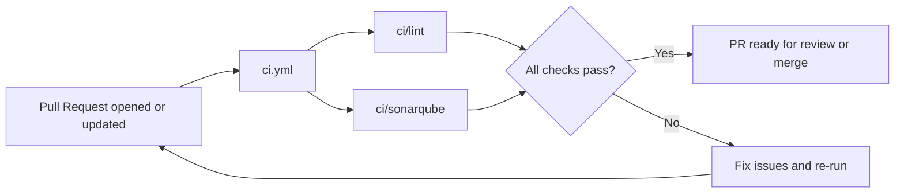

# Continuous Integration

GitHub Actions runs fast, parallel checks on every pull request to keep the codebase healthy.

- **Triggers:** pull requests to `main` and PR open/update/ready-for-review events.

## Workflows & Jobs

[`ci.yml`](../.github/workflows/ci.yml) contains two independent jobs that run in parallel:

- **ci/lint** — ESLint validation on the source.
- **ci/sonarqube** — SonarQube code-quality analysis for PRs.

## PR Titles & Auto-Labeling

- PR titles must use Conventional Commit format: `<type>(<scope>): <subject>` (scope optional, imperative, no period).
- Breaking changes add `!` before the colon: `feat!: ...` or `feat(api)!: ...`.
- `.github/workflows/pr-labeler.yml` applies labels based on the prefix:
  - `feat:` → `type: feat` + `semver: minor`
  - `fix:` → `type: fix` + `semver: patch`
  - `perf:` → `type: perf` + `semver: patch`
  - `docs|style|refactor|test|chore|ci:` → corresponding `type:` label (no semver)
  - `feat!:` / `fix!:` (with or without scope) → `semver: major`

## Workflow Flow Diagram



## Runners

Lint and quality jobs execute on macOS so iOS dependencies are available while keeping runtime low.

## Run Locally (parity)

```sh
yarn lint
yarn type-check
yarn test          # or yarn test:report for coverage
```

## Common Failures

- ESLint or TypeScript errors; reproduce locally with the commands above.
- SonarQube quality gate failures; open the GitHub check details for rule-level feedback.
- Occasional macOS runner flakiness; use “Re-run jobs” if the failure is infrastructure-related.

## SonarQube Notes

- Quality gate fails when new bugs/vulnerabilities are reported or when coverage on new code drops below the project gate configured in SonarQube.
- From a failed PR check, click the SonarQube link to see rule-level findings; fix or justify (with suppression only when appropriate) and re-run the job.
- Add or update tests to raise coverage on changed files; snapshots alone rarely fix coverage gates.

## CI-related issues

Open a GitHub issue with the `Devops` label (and any relevant labels) and include the failing workflow run link.
