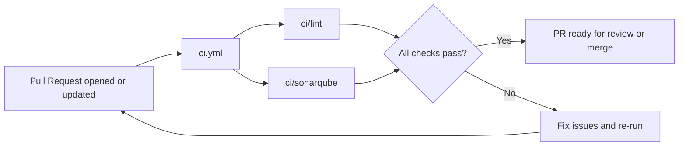

# Continuous Integration

GitHub Actions runs fast, parallel checks on every pull request to keep the codebase healthy.

- **Triggers:** pull requests to `main` and PR open/update/ready-for-review events.

## Workflows & Jobs

[`ci.yml`](../.github/workflows/ci.yml) contains two independent jobs that run in parallel:

- **ci/lint** — ESLint validation on the source.
- **ci/sonarqube** — SonarQube code-quality analysis for PRs.

## PR Titles & Auto-Labeling

Use Conventional Commit titles so the [`pr-labeler.yml`](../.github/workflows/pr-labeler.yml) workflow can tag PRs automatically and signal the expected semver impact.

- **Format:** `<type>(<scope>): <subject>` — scope optional, ≤50 chars, imperative, no period.
  - **type:** one of `feat|fix|perf|docs|style|refactor|test|chore|ci`.
  - **scope:** optional component/package in parentheses, e.g., `app`, `auth`, `api`.
  - **subject:** short present-tense summary (no trailing period).
- **Breaking changes:** add `!` before the colon: `feat!: ...` or `feat(api)!: ...`.
- **Enforcement:** the workflow fails if the prefix is missing/invalid, so titles must be fixed before merge.
- **Labels created + colored:** the workflow creates/updates the `type:` and `semver:` labels with preset colors and descriptions, then applies them to the PR.
- **Mappings:** `feat:` → `type: feat` + `semver: minor`; `fix:` → `type: fix` + `semver: patch`; `perf:` → `type: perf` + `semver: patch`; `docs|style|refactor|test|chore|ci:` → matching `type:` label (no semver); `feat!:` / `fix!:` (with or without scope) → `semver: major`.
- **Why:** reviewers see the change type at a glance, release automation can infer bump size, and changelog triage stays consistent with commit semantics.

### Label mapping

| PR Title Prefix                | Applied Label(s)                   | Notes                                  |
| ------------------------------ | ---------------------------------- | -------------------------------------- |
| `feat:`                        | `type: feat`, `semver: minor`      | New user-facing capability             |
| `fix:`                         | `type: fix`, `semver: patch`       | Bug fix for users                      |
| `perf:`                        | `type: perf`, `semver: patch`      | Performance improvement                |
| `docs:`                        | `type: docs`                       | Documentation-only                     |
| `style:`                       | `type: style`                      | Formatting, no logic change            |
| `refactor:`                    | `type: refactor`                   | Behavior-preserving restructuring      |
| `test:`                        | `type: test`                       | Add/update tests                       |
| `chore:`                       | `type: chore`                      | Maintenance/tooling/infra              |
| `ci:`                          | `type: ci`                         | CI/CD config changes                   |
| `feat!:` / `feat(scope)!:`     | `type: feat`, `semver: major`      | Breaking change                        |
| `fix!:` / `fix(scope)!:`       | `type: fix`, `semver: major`       | Breaking change                        |

Scopes are optional and help route reviews: `feat(auth): ...` or `fix(app)!: ...` still apply the same labels.

## Workflow Flow Diagram



## Runners

Lint and quality jobs execute on macOS so iOS dependencies are available while keeping runtime low.

## Run Locally (parity)

```sh
yarn lint
yarn type-check
yarn test          # or yarn test:report for coverage
```

## Common Failures

- ESLint or TypeScript errors; reproduce locally with the commands above.
- SonarQube quality gate failures; open the GitHub check details for rule-level feedback.
- Occasional macOS runner flakiness; use “Re-run jobs” if the failure is infrastructure-related.

## SonarQube Notes

- Quality gate fails when new bugs/vulnerabilities are reported or when coverage on new code drops below the project gate configured in SonarQube.
- From a failed PR check, click the SonarQube link to see rule-level findings; fix or justify (with suppression only when appropriate) and re-run the job.
- Add or update tests to raise coverage on changed files; snapshots alone rarely fix coverage gates.

## CI-related issues

Open a GitHub issue with the `Devops` label (and any relevant labels) and include the failing workflow run link.

## PR Labeler workflow (separate from CI)

- `.github/workflows/pr-labeler.yml` runs on PR open/edit/sync and is **not part of `ci.yml`**.
- It validates semantic PR titles, creates/updates the `type:` / `semver:` labels with colors/descriptions, and applies them to the PR.
- If the title prefix is invalid or missing, the workflow fails and must be fixed before merge.
